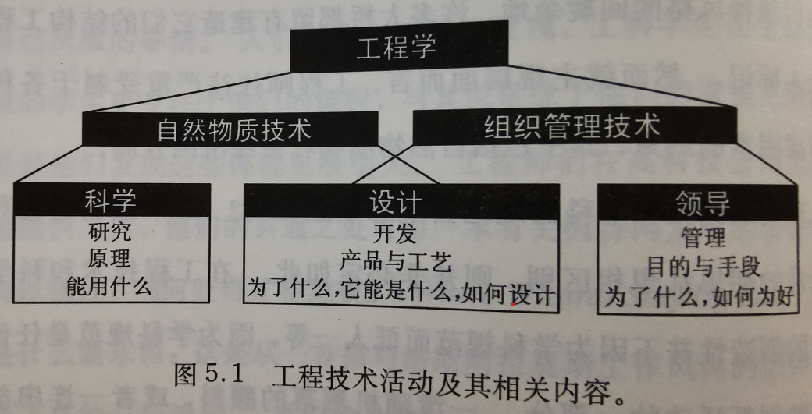
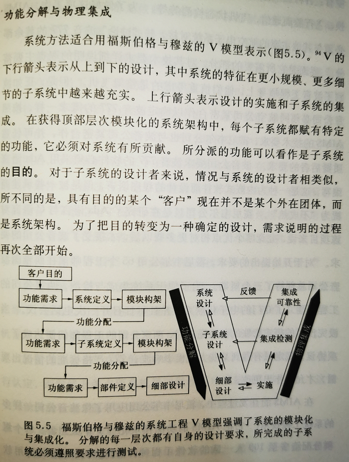

# 前言：被软件所推动的软件工程发展史

首先，这是一篇读书笔记。最近我读完了一本朋友推荐的好书《[工程学——无尽的前沿](https://book.douban.com/subject/27147169/)》，是由美籍华人物理学家欧阳莹之写的。虽然书中有很多值得细细品读的段落，但是在这本书中我最关心的，还是关于软件工程的段落。因为我看到过一些争论：“软件工程”是不是属于“工程学”的范畴？

## 软件工程是不是工程学的一种？

有人曾经说过：“就像社会工程学(Social Engineering)不是工程学一样，软件工程学(Software Engineering)也不是工程学！”

有兴趣的朋友，可以参考这三个讨论：
[在quora上的讨论：Is software engineering an engineering discipline or not?](https://www.quora.com/Is-software-engineering-an-engineering-discipline-or-not)
[在stackexchange上的讨论：# Is software development an engineering discipline?](https://softwareengineering.stackexchange.com/questions/111265/is-software-development-an-engineering-discipline)
[在reddit上的讨论：Is "software engineering" really engineering?](https://www.reddit.com/r/engineering/comments/3fvlcn/is_software_engineering_really_engineering/)

在读完本书后，我相当确信，软件工程肯定是工程学的分支之一，因为书中的两段描述：

---
土木工程师克拉克(Frederick Clarke)把广义的工程学很恰当地描述为：“它负有微妙而艰难的使命，要把科学抽象转化为世俗生活中的实践语言；这也许是世界上要求最为全面的任务。因为它需要理解**两个**不同的领域——不仅有科学赖以安身立命的纯理论，还有人类社会中所有复杂事物的目标、动力和渴望。工程师必须同时是一位哲学家、人文主义者和精明务实、身手不凡的匠人。他必须是一位足以知道应该**信仰**什么的哲学家，足以知道该**追求**什么的人文主义者，以及足以知道该**制作**什么的工匠。”

---

无论是前一段较为感性的定义，还是后一段较为理性的分析，都非常符合我对于软件工程的理解。（ps. 由此可以看出，**产品经理**也是软件工程师的一种）但是，为什么业界会出现这样的争论呢？在我看来，这与软件工程的发展历程有关。

## 软件工程的发展历程

早期的软件工程，是来源于软件危机，为了解决危机，软件开发者开始向传统的工程学寻求方法论。但是，软件工程的发展实在是太快了，越来越不像传统工程了。

例如：**敏捷软件开发和开源软件工程。**

敏捷软件开发，本质上是对于传统瀑布模型的一场反抗。而瀑布模型，才是直接从工程学的理念传承下来的。

敏捷的模型，基于一个完全不同的假设：我们无法（也不应该）在系统开发之前，分析所有需求。我们可以在系统有了第一个原型之后，再反复迭代。（参考：分析瘫痪）

至于开源软件的开发，就更加惊人了，传统工程学所以理解的“**严密组织，科学管理**”被进一步颠覆了。一个松散的组织，一群自由来去的爱好者，在一个并不明确的目标下工作——“Just for Fun”。但是却创造出惊人的开源软件，不仅仅包含了诸多创新，而且质量非常优秀。

到了现在，敏捷、DevOps、开源、云计算、AI，各种各样的思潮不断涌现，软件工程已经渐行渐远，越来越不像“那些工程”了。

## 如何研究软件工程的发展历程？

这篇文章，同时有可能是一本书《软件工程发展史》的前言。因为目前我所能找到的软件工程相关书籍，都没有深入分析过：为何软件工程，会这样发展。所以，我感到相当的不满意！

我最喜欢的历史学家钱穆先生，在《国史大纲》的前言中说道：“治国史之第一任务，在能于国家民族之内部自身，求得其独特精神之所在。”

按照同样的思路来看软件工程发展史，也不能仅仅把一堆事件、方法、技术罗列出来，而是要寻求发展背后的独特的“精神”所在。是什么在推动着软件工程，一直不断的向前发展？

我想提出的一种历史研究的思路是：虽然不能简单的断定因果，但是可以做依赖分析。在历史发展的过程中，一个事物的诞生，虽然我们不能找全所有的充分必要条件，但是必要条件（前置依赖项），是可以找到的。

从现代软件工程的特征，回望发展历程，我们找到了以下依赖项：

1. 计算机 --> 软件 --> 软件工程
2. 工程学 -->  软件工程 -->  现代软件工程
3. 网络 --> 互联网 --> 开源软件 --> 基于开源的软件工程 --> 可信软件工程
4. 计算机网络 --> 互联网 --> 云计算 --> 基于云的软件架构 --> DevOps

这里列出的各条线索，也许可以随后可以画出一个更加清晰的，依赖发展时间线。简单的总结，我们可以说：**软件的飞速发展，推动了软件工程的飞速发展。因为软件开发所用到的工具，所依赖的环境、操作系统、框架和类库，也是软件。因此，软件开发人员会在工作中，不断的改造，完善，创新着自己的工具（这在其他领域，却非常罕见），这就是导致了软件工程，得以飞速发展的原动力。**

当然，详细的讨论，可能真的得写出一本书来了。

## 软件与软件工程的发展反哺工程学

虽然软件工程脱胎于工程学，但是现在的趋势却是：越来越多的工程领域，开始使用软件，并且开始吸纳现代软件工程中的思想，这就形成了一种反哺。

传统的系统工程思维，往往是“左移”。测试左移，设计左移，越是重要的决策，越是早做，因为越晚做，代价越大。既然犯错误的代价很大，那就尽量不犯错。

但是，我们也可以从另一个思路来解决问题：既然我们无法避免犯错，那就用模拟的方式，用自动化测试的方式，用快速迭代的方式，降低决策成本，降低试错的成本。

这两种思路，并非简单的你对我错，而是需要在一个更大的模型中，综合考虑、选择运用。

## 总结

在工程学的大家庭里，软件工程学从早期的求助、借鉴于传统工程学，逐渐发展壮大，到现在的反哺、增强其他领域的工程学。软件工程，注定会成为工程学中越来越强壮的一员。